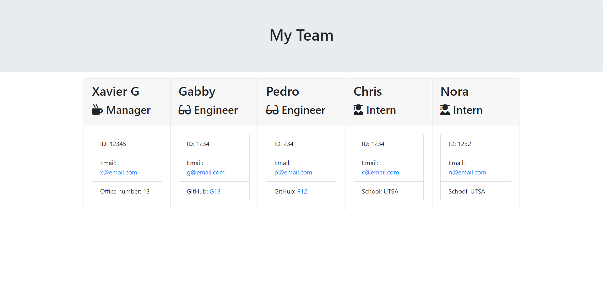

# Team Profile Generator

# Table of Contents:

1. [Description](#description)
2. [Installation Process](#installation-process)
3. [Usage](#usage)
4. [License](#license)
5. [Contributors](#contributors)
6. [Testing](#testing)
7. [Github Username](#github-username)
8. [Email Address](#email-address)
9. [Examples](#examples)

## Questions:

- Contact Me:
  - If you have any questions about the application please email me at guzmanxavi112@gmail.com.
  - Here you can find my Github page [XavierG13](https://github.com/XavierG13)

## Description:

This app will allow users to create a team base comprised of a Manager, Engineer, and Intern. User's will also be allowed to add multiple engineers and interns.

## Installation Process:

npm install, npm install jest, npm install inquirer, npm install path

## Usage:

It is used to generate a Team of Developers of the user's choosing. User will need to run in terminal to be prompted questions for each individual role. 

After creating a manager the user will now be able to add as many engineers and interns as they need. 

Once the user is done adding their members they will be asked to Finish and then this will update the html for each role and be used in the team.html.

## License:

- This application is covered under the MIT license.

## Contributors:

N/A

## Testing:

User will need to run test to check if all tests in the lib folder are being coded properly. 

Next, the user will need to install any required packages and then use node app.js to run initial prompts. Prompts will need to be answered, if not information will be left out.

## Tools/Framework
* HTML
* CSS
* JavaScript
* jQuery
* Node.JS
* Jest/Test

### Github Username:

XavierG13

### Email Address:

guzmanxavi112@gmail.com

# Examples:

## Video:

- [Link to video](https://drive.google.com/file/d/1K-9-JNZHIfjdYB5GDdo2RDbSCgf3LBZP/view)

## Images:

